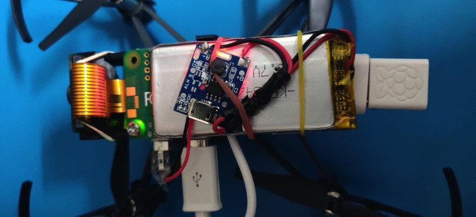
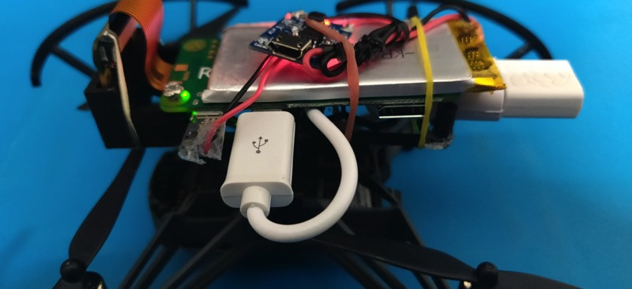
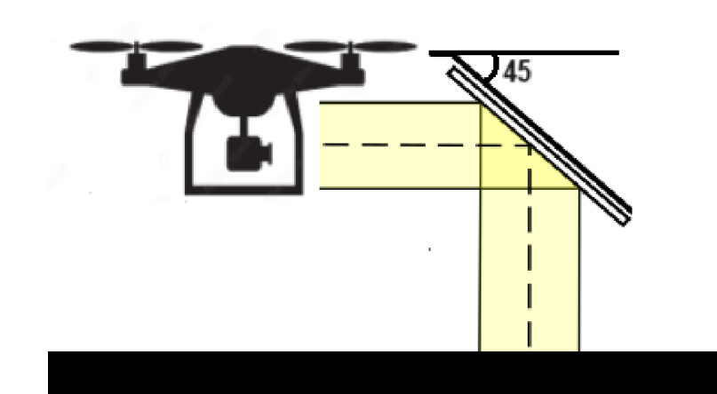

# UAV line-following using image processing

   focuses on researching and developing a UAV system capable of autonomously controlling and maintaining flight along a pre-defined path (line), while utilizing image processing techniques to detect and analyze data of the line path. The project emphasizes analyzing, designing, and implementing image processing algorithms and suitable PD controllers to achieve this goal. Specific tasks include line detection for the drone to follow, collecting necessary data for autonomous line-following, and constructing PD controllers integrated with the image processing system. The expected outcome of the project is a flexible and efficient UAV system capable of accurately and stably flying along a predetermined line path

Here is a video of the drone in action (click the image -->):

## 2 Option:
### (OPTION 1) Using Raspberry Pi Zero and camera module (erviveksoni:[Control DJI Tello using Raspberry Pi Zero](https://github.com/erviveksoni/raspberrypi-controlled-tello?tab=readme-ov-file))
#### Prerequisites
- Raspberry Pi Zero W
- Raspberry Pi Camera V2
- wifi adapter
- [DJI Tello](https://store.dji.com/product/tello). Ensure your Tello is setup and you are able to fly with your phone app.
- [WiFi Dongle](https://www.raspberrypi.org/products/raspberry-pi-usb-wifi-dongle/)
- Micro USB to USB Type A female adapter [something like this](https://www.amazon.com/CableCreation-Adapter-Compatible-Samsung-Function/dp/B01LXBS8EJ/)
- 5V Step-Up Power Module Lithium Battery Charging Protection Board
  
- 3.7V 1200mah LiPo battery (Try getting the size: 30mm x 63mm x 4.75mm so it fits nicely over the drone)
- Male micro usb cable head. You can use any old micro usb cable and cut micro usb head along with a small length of wire.
 
- Wires
- Solderign gun
#### Hardware
##### Creating the LiPo Battery Module
We wont be using the USB output from the Tello to power our Raspberry Pi Zero for obvious reason :-). Lets create our own power source to power the Raspberry Pi Zero as well as a permanent setup to charge it.
 - Remove the USB Type A shell from the module carefully (You may need to use a plair). Ensure the +ve and -ve output points are visible on the chip.
 - Solder the micro usb wires -> black to the -ve and red to +ve output points.
 - Follow this [youtube link](https://www.youtube.com/watch?v=KB8S83aY35w) to solder the LiPo connector to the charging module. 
 - Check whether the inout and output are working from the above setup.

##### Mounting Raspberry Pi Zero on Tello Mount
 - Assemble the 3D printed Raspberry Pi Zero Tello mount.
 - Optional: Connect the Raspberry Pi Zero Camera module to Raspberry Pi Zero
 - Mount the Raspberry Pi Zero on the 3D printed assembled mount. You can a combination of screw which fits into the mount and rubber bands (check the images).
 - Also connect the LiPo batter module and the Micro USB to USB Type A female adapter + Wifi dongle to the Raspberry Pi Zero.

##### Mounting the 3D Mount on Tello
 - Detach the canopy from Tello
 - Snap the 3D Printed case on top of the Tello 
#### Software

##### Setting up Raspberry Pi Operating System
We will setup Raspberry Pi in headless mode to get the optimal usage of RAM and CPU. There are many good posts on how to setup Raspbian Buster Lite on the Raspberry Pi Zero in [Headless Mode](https://desertbot.io/blog/setup-pi-zero-w-headless-wifi/) 

At this point in time, we should be able to SSH into out Pi using the Wifi onboard. Also the Pi will be most likey have access to the internet (dependeing on your WIFI network settings).

##### Connecting Raspberry Pi Zero to Tello
> __Note__: The steps in the section below are completely optional for this project. You can directly configure Raspberry Pi Zero to connect to Tello's WIFI network.
>The steps for doing this will be similar to the once you followed during setting up the Raspberry Pi.
>Though needless to say, your laptop should be connected to Tello's network to be able to run this application.

When you turn on Tello, it configures itself as an AP allowing the clients to connect and control to it. Once a client is connected to Tello, it looses internet connectivity. 
I wanted to avoid this blocker for a few project ideas I had in mind hence I configured the Raspberry Pi with dual WIFI interfaces. 

The Raspberry Pi Zero's onboard WIFI connects to my home network and the WIFI Adapter connects to Tello's WIFI.

- Ensure the WIFI dongle is connected to the Raspberry Pi Zero micro usb port
- Power on Raspberry Pi
- SSH into Raspberry Pi Zero
- Type `lsusb`. Ensure you see the WIFI USB adapter listed on the console output
- Type `sudo nano /etc/network/interfaces` to edit the network interfaces file
- Add the text below towards the end of the file. 
Replace the `TELLO_NETWORK_NAME` with the WIFI AP name of Tello followed by its password.
### (OPTION 2) Using reflective mirrors
#### Prerequisites
- [DJI Tello](https://store.dji.com/product/tello). Ensure your Tello is setup and you are able to fly with your phone app.
- Mirror (20x20 mm)
##### Mounting the mirors Mount on Tello
Attach a reflective mirror to the front of the drone's camera and adjust it to a 45-degree angle relative to the ground.

## PD Controler for oy axis
### Set speed
The input image from the Tello drone's camera after preprocessing with OpenCV2 will have dimensions of 480x360 (width x height). To make the drone follow the center of the line, we need to track the center point of the drone on the camera and the detected line. Therefore, the resulting center point will range between 0 and 480 pixels.

For the drone to follow the center of the line, the drone's center point and the line's center point must coincide and be equal to half of the maximum width, which is 480/2 or 240 pixels.

To find a starting value for Kp, we calculate the maximum possible error and determine the conversion factor between this maximum error value and the speed we set for the drone initially. If the drone slips away from the line and moves towards the right of the line, the farthest point between the line and the drone will return 0 pixels. Our target is set at 240 pixels, so the maximum error on the right side is 240 - 0, which equals 240 pixels. Similarly, if the drone slips away from the line and moves towards the left, the farthest point between the line and the drone will return 480 pixels. Subtracting our target value from this yields 240 - 480, or -240 pixels (ignoring the negative sign). In both cases, the maximum error is 240 pixels (disregarding the sign).

If we set the maximum speed for the drone to be 10%, then we need to find a proportionality factor to convert from 240 pixels to 10 when the drone is at the farthest position from the line's center. When the camera begins to detect the line on the right or left side, the drone should start adjusting with the following formula: Kp * error = 10. From this, we derive the specific formula to find the proportionality factor:

Kp * Max error = Max Speed

Where:
Kp: Proportionality factor
Max error: Maximum error
Max Speed: Maximum speed of the drone
Thus, we have Kp = Max Speed / Max error, so Kp = 10 / 240 = 0.0416.
### Kp = 0,0416 (Click the image for video)
Result: [Kp = 0,0416](https://www.youtube.com/watch?v=DMcX5RvyEMo) (Video)

### Kp = 0,0832 
Result: [Kp = 0,0832](https://www.youtube.com/watch?v=r6ehLc6K7bI) (Video)

### Kp = 0,12
Result:[Kp = 0,12](https://www.youtube.com/watch?v=N4tQ0srS11k) (Video)

### Kd
The Ziegler-Nichols method suggests determining an appropriate value for Kd using the formula:

\[Kd = Kp \times \frac{T}{8}\]

Where:
- \(Kp\) is the proportional gain,
- \(T\) is the oscillation period when the system is stable.

From the experimental result with \(Kp' = 0.124\), we obtain an oscillation period \(T = 15.1\) seconds with a sampling time of \(0.05\) seconds.

Applying the formula with \(Kp = 0.0744\) and \(T = 15.1\), we can find the derivative gain \(Kd\) for the PD controller for the y-axis:

\[Kd = 0.0744 \times \frac{15.1}{8}\]

\[Kd \approx 0.1398\]

So, the appropriate value of \(Kd\) for the PD controller for the y-axis is approximately \(0.1398\).

## PD Controler for rotale in oz axis
